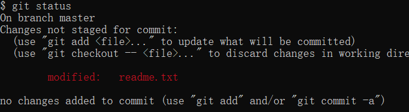

[TOC]


> 参考:
>
> [廖雪峰的官方网站](https://www.liaoxuefeng.com/wiki/0013739516305929606dd18361248578c67b8067c8c017b000)


### 创建空目录

```bash
mkdir learngit
cd learngit
pwd

# pwd 命令哦那个与显示当前目录
```

### 创建仓库

```bash
git init
```

创建了一个空仓库。目录下多了一个.git目录。这个目录时git用来跟踪管理版本库的，不要修改里面的文件，否则会破坏git仓库。


### 把文件添加到版本库

在新建的learngit目录下，新建readme.txt文件，内容如下：

```
Git is a version control system.
Git is free software.
```


1. 使用命令`git add`告诉Git，把文件添加到仓库：

```bash
git add readme.txt
```

2. 用命令`git commit`告诉Git，把文件提交到仓库：

```bashe
git commit -m "wrote a readme file"
```

> -m后面输入的是本次提交的说明，可以输入任意内容，当然最好是有意义的，这样你就能从历史记录里方便地找到改动记录。
>
> git commit`命令执行成功后会告诉你，`1 file changed`：1个文件被改动（我们新添加的readme.txt文件）；`2 insertions`：插入了两行内容（readme.txt有两行内容）。

### 查看状态

`git status`命令可以让我们时刻掌握仓库当前的状态

```bash
git status
```

### 查看不同

```bash
git diff
```

### 查看提交日志

```bash
git log
git log --pretty=oneline  #信息显示在一行
```


### 回退版本

```bash
git reset --hard HEAD^
```

在Git中，用`HEAD`表示当前版本，上一个版本就是`HEAD^`，上上一个版本就是`HEAD^^`，也可以写成`HEAD~1， HEAD~2`。

### 恢复版本

现在，你回退到了某个版本，关掉了电脑，第二天早上就后悔了，想恢复到新版本怎么办？找不到新版本的`commit id`怎么办？

在Git中，总是有后悔药可以吃的。当你用`$ git reset --hard HEAD^`回退到`add distributed`版本时，再想恢复到`append GPL`，就必须找到`append GPL`的commit id。Git提供了一个命令`git reflog`用来记录你的每一次命令：

```bash
git reflog
git reset --hard comit_id
```


### 工作区和暂存区

#### 工作区（Working Directory）

就是你在电脑里能看到的目录，比如我的`learngit`文件夹就是一个工作区：


#### 版本库（Repository）

工作区有一个隐藏目录`.git`，这个不算工作区，而是Git的版本库。


Git的版本库里存了很多东西，其中最重要的就是称为stage（或者叫index）的暂存区，还有Git为我们自动创建的第一个分支`master`，以及指向`master`的一个指针叫`HEAD`


我们把文件往Git版本库里添加的时候，是分两步执行的：

第一步是用`git add`把文件添加进去，实际上就是把文件修改添加到暂存区；


第二步是用`git commit`提交更改，实际上就是把暂存区的所有内容提交到当前分支。


因为我们创建Git版本库时，Git自动为我们创建了唯一一个`master`分支，所以，现在，`git commit`就是往`master`分支上提交更改。

你可以简单理解为，需要提交的文件修改通通放到暂存区，然后，一次性提交暂存区的所有修改。


### 撤销修改

#### `撤销git add`之前的文件修改

如果修改了本地文件，可以手动把文件恢复到上一个版本的状态。使用

```bashe
git checkout -- readme.txt
```

命令`git checkout -- readme.txt`意思就是，把`readme.txt`文件在工作区的修改全部撤销，这里有两种情况：

一种是`readme.txt`自修改后还没有被放到暂存区，现在，撤销修改就回到和版本库一模一样的状态；

一种是`readme.txt`已经添加到暂存区后，又作了修改，现在，撤销修改就回到添加到暂存区后的状态。

总之，就是让这个文件回到最近一次`git commit`或`git add`时的状态。

`git checkout -- file`命令中的`--`很重要，没有`--`，就变成了“切换到另一个分支”的命令，


#### 撤销git add`之后的文件修改

用命令

```bashe
git reset HEAD <file>
```

可以把暂存区的修改撤销掉（unstage），重新放回工作区：

`git reset`命令既可以回退版本，也可以把暂存区的修改回退到工作区。当我们用`HEAD`时，表示最新的版本。

再用`git status`查看一下，现在暂存区是干净的，工作区有修改：



之后在使用`git checkout -- readme.txt`丢弃工作区的修改。


### 删除文件

- 新建文件test.txt
- 执行`git add test.txt`和`git commit -m "add test.txt"`

- 删除test.txt文件
- 使用`git status`查看


现在你有两个选择，

1. 确实要从版本库中删除该文件，那就用命令`git rm`删掉，并且`git commit`，现在，文件就从版本库中被删除了。


2. 另一种情况是删错了，因为版本库里还有呢，所以可以很轻松地把误删的文件恢复到最新版本：

```bash
git checkout -- test.txt
```

`git checkout`其实是用版本库里的版本替换工作区的版本，无论工作区是修改还是删除，都可以“一键还原”。


### 远程仓库

以下操作需要有`github`账户。

1. 创建SSH Key。在用户主目录下(`C:\Users\administrator\.ssh`)，看看有没有`.ssh`目录，如果有，再看看这个目录下有没有`id_rsa`和`id_rsa.pub`这两个文件，如果已经有了，可直接跳到下一步。如果没有，打开Shell（Windows下打开Git Bash），创建SSH Key：

```bash
ssh-keygen -t rsa -C "youremail@example.com"
```

如果一切顺利的话，可以在用户主目录里找到`.ssh`目录，里面有`id_rsa`和`id_rsa.pub`两个文件，这两个就是SSH Key的秘钥对，`id_rsa`是私钥，不能泄露出去，`id_rsa.pub`是公钥，可以放心地告诉任何人。

2. 登陆GitHub，打开“Account settings”，“SSH Keys”页面，点“Add SSH Key”，填上任意Title，在Key文本框里粘贴`id_rsa.pub`文件的内容，点“Add Key”。


SSH Key的作用：GitHub需要识别出提交的人，而Git支持SSH协议，所以，GitHub只要知道了你的公钥，就可以确认只有你自己才能推送。

GitHub允许你添加多个Key。只要把每台电脑的Key都添加到GitHub，就可以在每台电脑上往GitHub推送了。


### 添加远程库

1. 在`github`仓库下，新建一个名为`learngit`的仓库。可以从这个仓库克隆出新的仓库，也可以把一个已有的本地仓库与之关联，

2. 在本地的`learngit`仓库下运行命令：

   ```
   $ git remote add origin git@github.com:michaelliao/learngit.git
   ```

   这条命令就将本地库与`github`下的仓库关联了。

   添加后，远程库的名字就是`origin`，这是Git默认的叫法，也可以改成别的，但是`origin`这个名字一看就知道是远程库。

3. 把本地库的所有内容推送到远程库上：

   ```bash
   git push -u origin master
   ```

   把本地库的内容推送到远程，用`git push`命令，实际上是把当前分支`master`推送到远程。

   由于远程库是空的，我们第一次推送`master`分支时，加上了`-u`参数，Git不但会把本地的`master`分支内容推送的远程新的`master`分支，还会把本地的`master`分支和远程的`master`分支关联起来，在以后的推送或者拉取时就可以简化命令。

4. 推送成功后，可以立刻在GitHub页面中看到远程库的内容已经和本地一模一样：

   

5. 现在起，只要本地作了提交，就可以通过命令：

   ```
   $ git push origin master
   ```

   把本地`master`分支的最新修改推送至GitHub，现在，你就拥有了真正的分布式版本库！

### SSH警告

当你第一次使用Git的`clone`或者`push`命令连接GitHub时，会得到一个警告：

```
The authenticity of host 'github.com (xx.xx.xx.xx)' can't be established.
RSA key fingerprint is xx.xx.xx.xx.xx.
Are you sure you want to continue connecting (yes/no)?
```

这是因为Git使用SSH连接，而SSH连接在第一次验证GitHub服务器的Key时，需要你确认GitHub的Key的指纹信息是否真的来自GitHub的服务器，输入`yes`回车即可。

Git会输出一个警告，告诉你已经把GitHub的Key添加到本机的一个信任列表里了：

```
Warning: Permanently added 'github.com' (RSA) to the list of known hosts.
```

这个警告只会出现一次，后面的操作就不会有任何警告了。

如果你实在担心有人冒充GitHub服务器，输入`yes`前可以对照[GitHub的RSA Key的指纹信息](https://help.github.com/articles/what-are-github-s-ssh-key-fingerprints/)是否与SSH连接给出的一致。


### 从远程库克隆

假设我们从零开发，那么最好的方式是先创建远程库，然后，从远程库克隆。

1. 登陆GitHub，创建一个新的仓库，名字叫`gitskills`。我们勾选`Initialize this repository with a README`，这样GitHub会自动为我们创建一个`README.md`文件。创建完毕后，可以看到`README.md`文件。

2. 用命令`git clone`克隆一个本地库：

   ```bash
   git clone https://github.com/OneYuanYuanYuan/gitskills.git
   ```

   然后进入`gitskills`目录看看，已经有`README.md`文件了。

   也可以指定文件夹名：

   ```bash
   git clone https://github.com/OneYuanYuanYuan/gitskills.git gitskills
   ```


### 分支合并

1. 创建dev分支，并切换到dev分支

   ```bash
   git checkout -b dev
   ```

   `git checkout`命令加上`-b`参数表示创建并切换，相当于以下两条命令：

   ```
   $ git branch dev
   $ git checkout dev
   Switched to branch 'dev'
   ```

2. 查看分支

   ```bash
   git branch
   * dev
     master
   ```

   `git branch`命令会列出所有分支，当前分支前面会标一个`*`号。

3. 提交

   ```bash
   git add readme.txt
   git commit -m "branch test"
   ```

4. 切换回master分支

   ```bash
   $ git checkout master
   Switched to branch 'master'
   ```

   切换回`master`分支后，再查看一个readme.txt文件，刚才添加的内容不见了！因为那个提交是在`dev`分支上，而`master`分支此刻的提交点并没有变。

   

5. 把`dev`分支的工作成果合并到`master`分支上

   ```bash
   $ git merge dev
   Updating a45287c..502a38f
   Fast-forward
    readme.txt | 1 +
    1 file changed, 1 insertion(+)
   ```

   `git merge`命令用于合并指定分支到当前分支。合并后，再查看readme.txt的内容，就可以看到，和`dev`分支的最新提交是完全一样的。

   注意到上面的`Fast-forward`信息，Git告诉我们，这次合并是“快进模式”，也就是直接把`master`指向`dev`的当前提交，所以合并速度非常快。

   当然，也不是每次合并都能`Fast-forward`。

   

6. 删除dev分支

   ```bash
   $ git branch -d dev
   Deleted branch dev (was 502a38f).
   ```

   


### 2个分支都有提交时的合并

#### 1. 创建分支并提交修改

```bash
git checkout -b feature1
#修改readme.txt文件
git add readme.txt
git commit -m "add 111"
```


#### 2. 切换分支并提交

```bash
git checkout master
#修改readme.txt
git add readme.txt
git commit -m "add 222"
```


#### 3. 合并

这种情况下，Git无法执行“快速合并”，只能试图把各自的修改合并起来，但这种合并就可能会有冲突。

```bash
$ git merge feature1
Auto-merging readme.txt
CONFLICT (content): Merge conflict in readme.txt
Automatic merge failed; fix conflicts and then commit the result.
```

果然冲突了！Git告诉我们，`readme.txt`文件存在冲突，必须手动解决冲突后再提交。`git status`也可以告诉我们冲突的文件

```bash
$ git status
On branch master
Your branch is ahead of 'origin/master' by 2 commits.
  (use "git push" to publish your local commits)

You have unmerged paths.
  (fix conflicts and run "git commit")
  (use "git merge --abort" to abort the merge)

Unmerged paths:
  (use "git add <file>..." to mark resolution)

        both modified:   readme.txt

no changes added to commit (use "git add" and/or "git commit -a")
```

我们可以直接查看readme.txt的内容：

```bash

<<<<<<< HEAD
111
=======
222
>>>>>>> feature1
```

Git用`<<<<<<<`，`=======`，`>>>>>>>`标记出不同分支的内容，我们修改如下后保存

```bash
111
```

再提交

```bash
$ git add readme.txt
$ git commit -m "conflict fixed"
[master 66e7b00] conflict fixed
```


#### 4. 查看合并情况

用带参数的`git log`也可以看到分支的合并情况：

```bash
$ git log --graph --pretty=oneline --abbrev-commit
*   66e7b00 (HEAD -> master) conflict fixed
|\
| * 9a3a2ba (feature1) AND simple
* | 79145c2 &simle
|/
* 502a38f branch test
* a45287c (origin/master) remove test.txt
* 1804ad1 add test.txt
* 6140a2e git tracks changes 2
* e98a60f git tracks changes
* 1d9ec78 understand how stage works
* 6c001dd append GPL
* 9962395 add distributed
* 31ac7d0 wrote a readme file

```

用`git log --graph`命令可以看到分支合并图。

#### 5. 删除分支

```bash
$ git branch -d feature1
Deleted branch feature1 (was 9a3a2ba).
```


### 分支管理策略

通常，合并分支时，如果可能，Git会用`Fast forward`模式，但这种模式下，删除分支后，会丢掉分支信息。

如果要强制禁用`Fast forward`模式，Git就会在merge时生成一个新的commit，这样，从分支历史上就可以看出分支信息。

下面我们实战一下`--no-ff`方式的`git merge`：

创建分支

```bash
git checkout -b dev
git add readme.txt
git commit -m "add merge"
```

切换回master

```bash
git checkout master
```

准备合并`dev`分支，请注意`--no-ff`参数，表示禁用`Fast forward`：

```bash
$ git merge --no-ff -m "merge with no-ff" dev
Merge made by the 'recursive' strategy.
 readme.txt | 2 ++
 1 file changed, 2 insertions(+)
```

因为本次合并要创建一个新的commit，所以加上`-m`参数，把commit描述写进去。

合并后，我们用`git log`看看分支历史：

```bash
$ git log --graph --pretty=oneline --abbrev-commit
*   44e5e8f (HEAD -> master) merge with no-ff
|\
| * aea7e5e (dev) add merge
|/
*   66e7b00 conflict fixed
```

可以看到，不使用`Fast forward`模式，merge后就像这样：


##### ==合并分支时，加上`--no-ff`参数就可以用普通模式合并，合并后的历史有分支，能看出来曾经做过合并，而`fast forward`合并就看不出来曾经做过合并。==


### Bug分支

软件开发中，bug就像家常便饭一样。有了bug就需要修复，在Git中，由于分支是如此的强大，所以，每个bug都可以通过一个新的临时分支来修复，修复后，合并分支，然后将临时分支删除。

当你接到一个修复一个代号101的bug的任务时，很自然地，你想创建一个分支`issue-101`来修复它，但是，等等，当前正在`dev`上进行的工作还没有提交：

```bash
$ git status
On branch dev
Changes to be committed:
  (use "git reset HEAD <file>..." to unstage)

    new file:   hello.py

Changes not staged for commit:
  (use "git add <file>..." to update what will be committed)
  (use "git checkout -- <file>..." to discard changes in working directory)

    modified:   readme.txt
```

并不是你不想提交，而是工作只进行到一半，还没法提交，预计完成还需1天时间。但是，必须在两个小时内修复该bug，怎么办？

幸好，Git还提供了一个`stash`功能，可以把当前工作现场“储藏”起来，等以后恢复现场后继续工作：

```bash
$ git stash
Saved working directory and index state WIP on dev: f52c633 add merge
```

现在，用`git status`查看工作区，就是干净的（除非有没有被Git管理的文件），因此可以放心地创建分支来修复bug。

首先确定要在哪个分支上修复bug，假定需要在`master`分支上修复，就从`master`创建临时分支：

```bash
$ git checkout master
Switched to branch 'master'
Your branch is ahead of 'origin/master' by 6 commits.
  (use "git push" to publish your local commits)

$ git checkout -b issue-101
Switched to a new branch 'issue-101'
```

现在修复bug，需要把“Git is free software ...”改为“Git is a free software ...”，然后提交：

```bash
$ git add readme.txt 
$ git commit -m "fix bug 101"
[issue-101 4c805e2] fix bug 101
 1 file changed, 1 insertion(+), 1 deletion(-)
```

修复完成后，切换到`master`分支，并完成合并，最后删除`issue-101`分支：

```bash
$ git checkout master
Switched to branch 'master'
Your branch is ahead of 'origin/master' by 6 commits.
  (use "git push" to publish your local commits)

$ git merge --no-ff -m "merged bug fix 101" issue-101
Merge made by the 'recursive' strategy.
 readme.txt | 2 +-
 1 file changed, 1 insertion(+), 1 deletion(-)
```

现在，是时候接着回到`dev`分支干活

```bash
$ git checkout dev
Switched to branch 'dev'

$ git status
On branch dev
nothing to commit, working tree clean
```

工作区是干净的，刚才的工作现场存到哪去了？用`git stash list`命令看看：

```
$ git stash list
stash@{0}: WIP on dev: f52c633 add merge
```

工作现场还在，Git把stash内容存在某个地方了，但是需要恢复一下，有两个办法：

一是用`git stash apply`恢复，但是恢复后，stash内容并不删除，你需要用`git stash drop`来删除；

另一种方式是用`git stash pop`，恢复的同时把stash内容也删了：

```bash
$ git stash pop
On branch dev
Changes to be committed:
  (use "git reset HEAD <file>..." to unstage)

    new file:   hello.py

Changes not staged for commit:
  (use "git add <file>..." to update what will be committed)
  (use "git checkout -- <file>..." to discard changes in working directory)

    modified:   readme.txt

Dropped refs/stash@{0} (5d677e2ee266f39ea296182fb2354265b91b3b2a)
```

再用`git stash list`查看，就看不到任何stash内容了：

```
$ git stash list
```

你可以多次stash，恢复的时候，先用`git stash list`查看，然后恢复指定的stash，用命令：

```
$ git stash apply stash@{0}
```


### Feature分支

软件开发中，总有无穷无尽的新的功能要不断添加进来。

添加一个新功能时，你肯定不希望因为一些实验性质的代码，把主分支搞乱了，所以，每添加一个新功能，最好新建一个feature分支，在上面开发，完成后，合并，最后，删除该feature分支。

现在，你终于接到了一个新任务：开发代号为Vulcan的新功能，该功能计划用于下一代星际飞船。

于是准备开发：

```bash
$ git checkout -b feature-vulcan
Switched to a new branch 'feature-vulcan'
```

开发完毕：

```bash
$ git add vulcan.py

$ git status
On branch feature-vulcan
Changes to be committed:
  (use "git reset HEAD <file>..." to unstage)

    new file:   vulcan.py

$ git commit -m "add feature vulcan"
[feature-vulcan 287773e] add feature vulcan
 1 file changed, 2 insertions(+)
 create mode 100644 vulcan.py
```

切回`dev`，准备合并：

```bash
$ git checkout dev
```

一切顺利的话，feature分支和bug分支是类似的，合并，然后删除。

但是！

就在此时，接到上级命令，因经费不足，新功能必须取消！

虽然白干了，但是这个包含机密资料的分支还是必须就地销毁：

```bash
$ git branch -d feature-vulcan
error: The branch 'feature-vulcan' is not fully merged.
If you are sure you want to delete it, run 'git branch -D feature-vulcan'.
```

销毁失败。Git友情提醒，`feature-vulcan`分支还没有被合并，如果删除，将丢失掉修改，如果要强行删除，需要使用大写的`-D`参数。。

现在我们强行删除：

```bash
$ git branch -D feature-vulcan
Deleted branch feature-vulcan (was 287773e).
```

终于删除成功！


### 多人协作

当你从远程仓库克隆时，实际上Git自动把本地的`master`分支和远程的`master`分支对应起来了，并且，远程仓库的默认名称是`origin`。

要查看远程库的信息，用`git remote`：

```bash
$ git remote
origin
```

或者，用`git remote -v`显示更详细的信息：

```bash
$ git remote -v
origin  git@github.com:michaelliao/learngit.git (fetch)
origin  git@github.com:michaelliao/learngit.git (push)
```

上面显示了可以抓取和推送的`origin`的地址。如果没有推送权限，就看不到push的地址。

#### 推送分支

推送分支，就是把该分支上的所有本地提交推送到远程库。推送时，要指定本地分支，这样，Git就会把该分支推送到远程库对应的远程分支上：

```bash
$ git push origin master
```

如果要推送其他分支，比如`dev`，就改成：

```bash
$ git push origin dev
```

但是，并不是一定要把本地分支往远程推送，那么，哪些分支需要推送，哪些不需要呢？

- `master`分支是主分支，因此要时刻与远程同步；
- `dev`分支是开发分支，团队所有成员都需要在上面工作，所以也需要与远程同步；
- bug分支只用于在本地修复bug，就没必要推到远程了，除非老板要看看你每周到底修复了几个bug；
- feature分支是否推到远程，取决于你是否和你的小伙伴合作在上面开发。

总之，就是在Git中，分支完全可以在本地自己藏着玩，是否推送，视你的心情而定！


#### 抓取分支

多人协作时，大家都会往`master`和`dev`分支上推送各自的修改。

现在，模拟一个你的小伙伴，可以在另一台电脑（注意要把SSH Key添加到GitHub）或者同一台电脑的另一个目录下克隆：

```bash
$ git clone git@github.com:michaelliao/learngit.git
Cloning into 'learngit'...
remote: Counting objects: 40, done.
remote: Compressing objects: 100% (21/21), done.
remote: Total 40 (delta 14), reused 40 (delta 14), pack-reused 0
Receiving objects: 100% (40/40), done.
Resolving deltas: 100% (14/14), done.
```

当你的小伙伴从远程库clone时，默认情况下，你的小伙伴只能看到本地的`master`分支。不信可以用`git branch`命令看看：

```bash
$ git branch
* master
```

现在，你的小伙伴要在`dev`分支上开发，就必须创建远程`origin`的`dev`分支到本地，于是他用这个命令创建本地`dev`分支：

```
$ git checkout -b dev origin/dev
```

现在，他就可以在`dev`上继续修改，然后，时不时地把`dev`分支`push`到远程：

```bash
$ git add env.txt

$ git commit -m "add env"
[dev 7a5e5dd] add env
 1 file changed, 1 insertion(+)
 create mode 100644 env.txt

$ git push origin dev
Counting objects: 3, done.
Delta compression using up to 4 threads.
Compressing objects: 100% (2/2), done.
Writing objects: 100% (3/3), 308 bytes | 308.00 KiB/s, done.
Total 3 (delta 0), reused 0 (delta 0)
To github.com:michaelliao/learngit.git
   f52c633..7a5e5dd  dev -> dev

```

你的小伙伴已经向`origin/dev`分支推送了他的提交，而碰巧你也对同样的文件作了修改，并试图推送：

```bash
$ cat env.txt
env

$ git add env.txt

$ git commit -m "add new env"
[dev 7bd91f1] add new env
 1 file changed, 1 insertion(+)
 create mode 100644 env.txt

$ git push origin dev
To github.com:michaelliao/learngit.git
 ! [rejected]        dev -> dev (non-fast-forward)
error: failed to push some refs to 'git@github.com:michaelliao/learngit.git'
hint: Updates were rejected because the tip of your current branch is behind
hint: its remote counterpart. Integrate the remote changes (e.g.
hint: 'git pull ...') before pushing again.
hint: See the 'Note about fast-forwards' in 'git push --help' for details.
```

推送失败，因为你的小伙伴的最新提交和你试图推送的提交有冲突，解决办法也很简单，Git已经提示我们，先用`git pull`把最新的提交从`origin/dev`抓下来，然后，在本地合并，解决冲突，再推送：

```bash
$ git pull
There is no tracking information for the current branch.
Please specify which branch you want to merge with.
See git-pull(1) for details.

    git pull <remote> <branch>

If you wish to set tracking information for this branch you can do so with:

    git branch --set-upstream-to=origin/<branch> dev
```

`git pull`也失败了，原因是没有指定本地`dev`分支与远程`origin/dev`分支的链接，根据提示，设置`dev`和`origin/dev`的链接：

```bash
$ git branch --set-upstream-to=origin/dev dev
Branch 'dev' set up to track remote branch 'dev' from 'origin'.
```

再pull：

```bash
$ git pull
Auto-merging env.txt
CONFLICT (add/add): Merge conflict in env.txt
Automatic merge failed; fix conflicts and then commit the result.
```

这回`git pull`成功，但是合并有冲突，需要手动解决。解决后，提交，再push：

```bash
$ git commit -m "fix env conflict"
[dev 57c53ab] fix env conflict

$ git push origin dev
Counting objects: 6, done.
Delta compression using up to 4 threads.
Compressing objects: 100% (4/4), done.
Writing objects: 100% (6/6), 621 bytes | 621.00 KiB/s, done.
Total 6 (delta 0), reused 0 (delta 0)
To github.com:michaelliao/learngit.git
   7a5e5dd..57c53ab  dev -> dev
```

因此，多人协作的工作模式通常是这样：

1. 首先，可以试图用`git push origin <branch-name>`推送自己的修改；
2. 如果推送失败，则因为远程分支比你的本地更新，需要先用`git pull`试图合并；
3. 如果合并有冲突，则解决冲突，并在本地提交；
4. 没有冲突或者解决掉冲突后，再用`git push origin <branch-name>`推送就能成功！

如果`git pull`提示`no tracking information`，则说明本地分支和远程分支的链接关系没有创建，用命令`git branch --set-upstream-to <branch-name> origin/<branch-name>`。

这就是多人协作的工作模式，一旦熟悉了，就非常简单。


### Rebase

#### TBD


### 标签管理

#### 创建标签

##### 1. 切换到分支上

```bash
$ git branch
* dev
  master
$ git checkout master
Switched to branch 'master'
```

##### 2. 打一个新标签

命令如下:

```bash
git tag <name>
```

例:

```bash
$ git tag v1.0
```

可以用命令`git tag`查看所有标签：

```bash
$ git tag
v1.0
```

默认标签是打在最新提交的commit上的。有时候，如果忘了打标签，比如，现在已经是周五了，但应该在周一打的标签没有打，怎么办？

方法是找到历史提交的commit id，然后打上就可以了：

```bash
$ git log --pretty=oneline --abbrev-commit
12a631b (HEAD -> master, tag: v1.0, origin/master) merged bug fix 101
4c805e2 fix bug 101
e1e9c68 merge with no-ff
f52c633 add merge
cf810e4 conflict fixed
5dc6824 & simple
14096d0 AND simple
b17d20e branch test
d46f35e remove test.txt
b84166e add test.txt
519219b git tracks changes
e43a48b understand how stage works
1094adb append GPL
e475afc add distributed
eaadf4e wrote a readme file
```

比方说要对`add merge`这次提交打标签，它对应的commit id是`f52c633`，敲入命令：

```bash
$ git tag v0.9 f52c633
```

再用命令`git tag`查看标签：

```bash
$ git tag
v0.9
v1.0
```


##### 3. push tag到远端仓库

```
git push并不会把tag标签传送到远端服务器上，只有通过显式命令才能分享标签到远端仓库。
1.push单个tag，命令格式为：git push origin [tagname]
例如：
git push origin v1.0 #将本地v1.0的tag推送到远端服务器
2.push所有tag，命令格式为：git push [origin] --tags
例如：
git push --tags
或
git push origin --tags

```


##### 注意

标签不是按时间顺序列出，而是按字母排序的。可以用`git show <tagname>`查看标签信息：

```bash
$ git show v0.9
commit f52c63349bc3c1593499807e5c8e972b82c8f286 (tag: v0.9)
Author: Michael Liao <askxuefeng@gmail.com>
Date:   Fri May 18 21:56:54 2018 +0800

    add merge

diff --git a/readme.txt b/readme.txt
...
```

可以看到，`v0.9`确实打在`add merge`这次提交上。

还可以创建带有说明的标签，用`-a`指定标签名，`-m`指定说明文字：

```bash
$ git tag -a v0.1 -m "version 0.1 released" 1094adb
```

用命令`git show <tagname>`可以看到说明文字：

```bash
$ git show v0.1
tag v0.1
Tagger: Michael Liao <askxuefeng@gmail.com>
Date:   Fri May 18 22:48:43 2018 +0800

version 0.1 released

commit 1094adb7b9b3807259d8cb349e7df1d4d6477073 (tag: v0.1)
Author: Michael Liao <askxuefeng@gmail.com>
Date:   Fri May 18 21:06:15 2018 +0800

    append GPL

diff --git a/readme.txt b/readme.txt
...
```


#### 操作标签

如果标签打错了，也可以删除：

```bash
$ git tag -d v0.1
Deleted tag 'v0.1' (was f15b0dd)
```

因为创建的标签都只存储在本地，不会自动推送到远程。所以，打错的标签可以在本地安全删除。

如果要推送某个标签到远程，使用命令`git push origin <tagname>`：

```bash
$ git push origin v1.0
Total 0 (delta 0), reused 0 (delta 0)
To github.com:michaelliao/learngit.git
 * [new tag]         v1.0 -> v1.0
```

或者，一次性推送全部尚未推送到远程的本地标签：

```bash
$ git push origin --tags
Total 0 (delta 0), reused 0 (delta 0)
To github.com:michaelliao/learngit.git
 * [new tag]         v0.9 -> v0.9
```

如果标签已经推送到远程，要删除远程标签就麻烦一点，先从本地删除：

```bash
$ git tag -d v0.9
Deleted tag 'v0.9' (was f52c633)
```

然后，从远程删除。删除命令也是push，但是格式如下：

```bash
$ git push origin :refs/tags/v0.9
To github.com:michaelliao/learngit.git
 - [deleted]         v0.9
```

要看看是否真的从远程库删除了标签，可以登陆GitHub查看。

